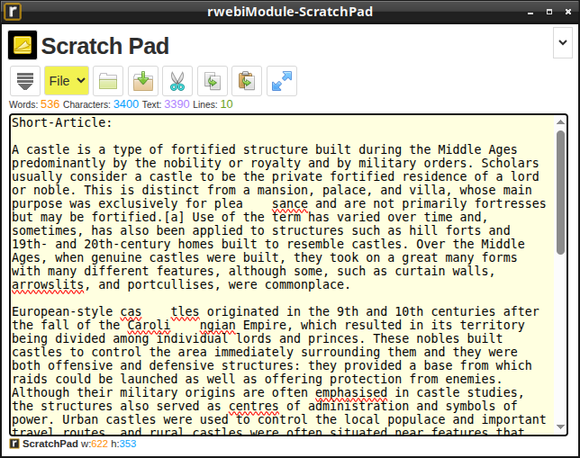

#  [rwebiModule-ScratchPad.html](rwebi.com/Modules/rwebiModule-ScratchPad)
A versatile digital piece of paper and text utility that allows users to instantly draft, format, and execute text-based documents directly from within the browser.

  

### Setup:
* 📦 [**Module-ScratchPad**](Modules/rwebiModule-ScratchPad.html) 
    * 🎨 [**../_css/**](../_css) [`rwebiStyle-Light-c61.css`](./_css/rwebiStyle-Light-c61.css) 
    * 🎨 [**../_css/**](../_css) [`rwebiStyle-Light-c61.css`](./_css/rwebiStyle-Dark-c61.css) 
    * ⚙️ [**../_jss/**](../_jss) [`rwebiModule-ScratchPad.js`](./_jss/rwebiModule-ScratchPad.js) 
    * ⚙️ [**../_jss/**](../_jss) [`rwebiEngine-LightCore-c61.js`](./_jss/rwebiEngine-LightCore-c61.js) 
    * 📖 [**../Help/**](../Help) [`rwebiHelp-ScratchPad.html`](./Help/rwebiHelp-ScratchPad.html) 
    * 🖼️ [**../_ico/**](../_ico) [`file.png`](./_ico/filename.png) 
    * 🖼️ [**../_ico/**](../_ico) [`file.png`](./_ico/filename.png) 
    * 🖼️ [**../_ico/**](../_ico) [`file.png`](./_ico/filename.png) 
    * 🖼️ [**../_ico/**](../_ico) [`file.png`](./_ico/filename.png) 
    * 🖼️ [**../_ico/**](../_ico) [`file.png`](./_ico/filename.png) 
    * 🖼️ [**../_ico/**](../_ico) [`file.png`](./_ico/filename.png) 
    * 🖼️ [**../_ico/**](../_ico) [`file.png`](./_ico/filename.png) 
    * 🖼️ [**../_ico/**](../_ico) [`file.png`](./_ico/filename.png) 
    * 🖼️ [**../_ico/**](./_ico) [`file.png`](./_ico/filename.png) 

